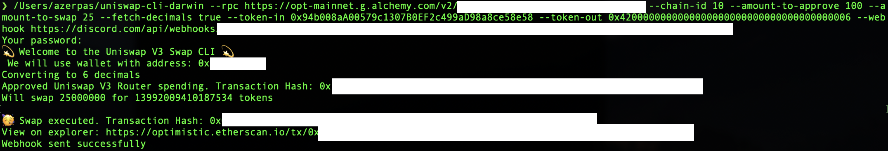
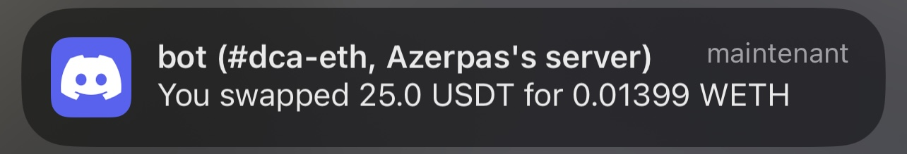

# Uniswap V3 Command Line Interface



A command line interface to swap tokens using Uniswap V3 Quoter and Router, [`ethers-rs`](https://docs.rs/ethers/latest/ethers/) and wallet encryption.

This script allows you swap a fixed amount of a given token for another token. It uses ChaCha20Poly1305 encryption to encrypt your mnemonic/seed phrase and store it in a file. The wallet is then used to sign the transactions. It will ask you for a password to encrypt your mnemonic once and to unlock your wallet every time you run the script if you don't use the [settings file to save your password](#save-password).

This script was originally created to swap a fixed amount of USDT for WETH every week as a dollar cost averaging strategy (DCA). You can CRON it to run every week.

## Features
📈 Quote the swap price using [Uniswap V3 Quoter](https://docs.uniswap.org/contracts/v3/reference/periphery/lens/Quoter)  
↔️ Swap tokens using [Uniswap V3 Router](https://docs.uniswap.org/contracts/v3/reference/overview#swaprouter)    
👛 Encrypt your mnemonic using [ChaCha20Poly1305](https://docs.rs/orion/latest/orion/aead/index.html)

## Installation
### Use the executable
Download the last version from [*Releases*](https://github.com/azerpas/dca-ethereum-onchain/releases)
- MacOS: `darwin`
- Linux: `linux`
- Windows: `.exe`

On MacOS, make sure to make the file executable:
```sh
chmod +x uniswap-cli-darwin
# if it still says `Permission denied`, try
chown 777 uniswap-cli-darwin
```
If you then get a `"uniswap-cli-darwin" cannot be opened because the developer cannot be verified` error, go to `System Preferences > Security & Privacy > General` and click `Open Anyway`

Then refer to [Usage](#Usage)

### Build from source
You can also clone the repo and run the script using cargo
```sh
git clone git@github.com:azerpas/uniswap-cli.git
cd uniswap-cli
cargo run -- -h
```

## Usage
- [Example of running the script on Goerli](#example)
- [Example of running the script on Ethereum Mainnet](#swap-25-usdt-for-some-weth-on-mainnet)
- [Example of swapping 5 USDT for WETHs on Optimism network with pre-approval spending](#swap-5-usdt-for-some-weth-on-optimism-network-with-pre-approval-spending)
```
Usage: uniswap-cli [OPTIONS] --amount-to-swap <AMOUNT_TO_SWAP> --token-in <TOKEN_IN> --token-out <TOKEN_OUT>

Options:
  -u, --rpc <RPC>
          HTTP URL of the RPC endpoint to connect to [default: https://mainnet.infura.io/v3/]
  -n, --chain-id <CHAIN_ID>
          Chain ID of the network to connect to (1 for mainnet, 3 for ropsten, 4 for rinkeby, 5 for goerli, 42 for kovan, for more checkout https://chainlist.org/) [default: 1]
  -a, --amount-to-approve <AMOUNT_TO_APPROVE>
          Amount of tokens to approve for the swap. Make sure to use the correct decimals, e.g 1 USDT = 1000000 as USDT has 6 decimals. If set to 0 it will approve the amount of tokens required for the swap. If the flag is not specified, it will skip the approval step
  -s, --amount-to-swap <AMOUNT_TO_SWAP>
          Amount of tokens to swap. If you don't use the 'd' (decimals) flag, make sure to use the correct decimals: e.g 1 USDT = 1000000 as USDT has 6 decimals. If you want to swap 0.5 tokens, you need to specify 0.5 * 10^decimals For example, if you want to swap 0.5 USDT, you need to specify 500000 (6 decimals) If you want to swap 0.5 WETH, you need to specify 500000000000000000 (18 decimals)
  -d, --fetch-decimals <FETCH_DECIMALS>
          Get the decimals of the token you want to swap from. If used, the given `amount_to_swap` and `amount_to_approve` will be multiplied by 10^`decimals` to get the correct amount. `decimals` are fetched from the token contract [possible values: true, false]
  -i, --token-in <TOKEN_IN>
          Address of the token to swap from. This is the token you want to sell. It must be a valid ERC20 token address (e.g USDT: 0xdAC17F958D2ee523a2206206994597C13D831ec7)
  -o, --token-out <TOKEN_OUT>
          Address of the token to swap to. This is the token you want to buy. It must be a valid ERC20 token address (e.g WETH: 0xC02aaA39b223FE8D0A0e5C4F27eAD9083C756Cc2)
  -v, --verbose
          Verbose mode, will print more information about the swap If not specified, it will only print the transaction hash
  -w, --webhook <WEBHOOK>
          Discord webhook URL to send the transaction hash to
  -h, --help
          Print help
  -V, --version
          Print version
```

### Example
#### Swap 1 UNI for some WETH on Goerli
`\` (aka command splitting doesn't work on Windows, don't use them)
```sh
cargo run -- --rpc "https://eth-goerli.g.alchemy.com/v2/{YOUR_API_KEY}" \ 
  --chain-id 5 --fetch-decimals true --amount-to-approve 1 --amount-to-swap 1 \
  --token-in "0x1f9840a85d5aF5bf1D1762F925BDADdC4201F984" --token-out "0xB4FBF271143F4FBf7B91A5ded31805e42b2208d6" 
```
- `-u` (`--rpc`) is the RPC endpoint to connect to. You can get an API key from an RPC provider like [Alchemy](https://www.alchemy.com/)
- `-n` (`--chain-id`) is the chain ID of the network to connect to. 5 is for Goerli
- `-d` (`--fetch-decimals`) is used to fetch the decimals of the token you want to swap from. If used, the given `amount_to_swap` and `amount_to_approve` will be multiplied by 10^`decimals` to get the correct amount. `decimals` are fetched from the token contract. For example, if you want to swap 0.5 USDT, you need to specify 500000 (USDT having 6 decimals) without the `-d` flag. With the `-d` flag, you can specify 0.5 and the script will fetch the decimals from the USDT contract and multiply 0.5 by 10^6 to get the correct amount.
- `-a` (`--amount-to-approve`) is the amount of tokens to approve for the swap. Make sure to use the correct decimals as specified above or use the `-d` flag.
- `-s` (`--amount-to-swap`) is the amount of tokens to swap. Make sure to use the correct decimals as specified above or use the `-d` flag.
- `-i` (`--token-in`) is the address of the token to swap from. This is the token you want to sell. It must be a valid ERC20 token address, here it's UNI on Goerli
- `-o` (`--token-out`) is the address of the token to swap to. This is the token you want to buy. It must be a valid ERC20 token address, here it's WETH on Goerli 

#### Swap 25 USDT for some WETH on Mainnet
```sh
uniswap-cli -u "https://mainnet.infura.io/v3/" \ 
  -n 1 -d true -a 25 -s 25 \
  -i "0xdAC17F958D2ee523a2206206994597C13D831ec7" -o "0xC02aaA39b223FE8D0A0e5C4F27eAD9083C756Cc2" 
```

#### Swap 5 USDT for some WETH on Optimism network with pre-approval spending
You have already approved the contract to spend your USDT tokens? You can skip the approval step by ommiting the `-a` flag and save some gas.
```sh
./uniswap-cli-darwin -u https://opt-mainnet.g.alchemy.com/v2/{YOUR_API_KEY} -n 10 \
 -d true -s 5 \
 -i "0x94b008aA00579c1307B0EF2c499aD98a8ce58e58" -o "0x4200000000000000000000000000000000000006"
```

### Discord webhook
You can specify a Discord webhook URL with the `-w` (`--webhook`) flag to send the transaction hash to. This is useful if you want to get notified when the transaction is done. You can create a webhook in your Discord server settings. [Here's a guide](https://support.discord.com/hc/en-us/articles/228383668-Intro-to-Webhooks) on how to create a webhook.

### Save password
⚠️ **This is not recommended as anyone with access to your home directory will be able to read the password, thus getting access to your wallet.** ⚠️
Instead of typing your password each time you run the script, you can modify located at `~/.uniswap-cli/settings.json` and add your password there. The file should look like this:
```json
{
  "webhook": null,
  "password": "your_password"
}
```
Useful if you want to run the script in a cron job for example.

If you choose to save your password in this file, my recommendations are:
- Use a different password than your others wallets passwords
- Make sure the permissions of the file are set for your user only
- Only use this feature if you're running the script on a trusted machine
- Only send an amount of tokens you're willing to lose, and do not use the seed phrase of your main wallet. Create a new wallet with a small amount of tokens and use this wallet's seed phrase to run the script.

## Disclaimer
This script is provided as is, without any warranty. I am not responsible for any loss of funds. Use at your own risk.
